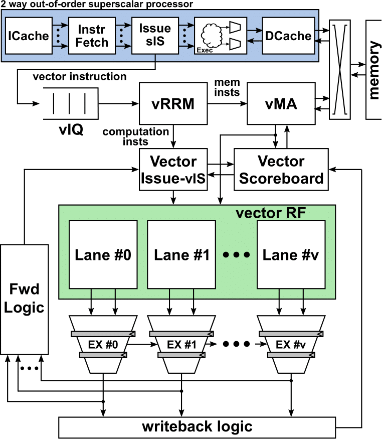

## RISC-V<sup>2</sup>: A vector processor implementing the RISC-V Vector ISA extension
Vector architectures are almost unique in their ability to effectively combine high programmability attributes, high computational throughput, and high energy efficiency. This work builds an efficient vector processor that implements the upcoming RISC-V vector ISA extension. The proposed architecture is founded on the traditional tenets of vector processing, and it introduces novel techniques that reap high performance benefits in a cost-effective implementation: 

- A new register remapping technique that together with a dynamically allocated register file enable dynamic hardware-based loop unrolling 
and optimized instruction scheduling at run-time.
- The design’s decoupled execution scheme employs resource acquire-and-release semantics to disambiguate between parallel computation and memory-access 
instruction streams, thereby allowing for independent execution/memory flow rates.
- A dynamically generated hardware reduction tree enables significant acceleration of reduction intstructions.
- Variable execution latency based on instruction type

RISC-V<sup>2</sup> is integrated in a two-way superscalar OoO core. 

 

The scalar core acts as the main control processor, with all the instructions being fetched and decoded in the scalar pipeline.
During the superscalar issue stage, the instructions are diverted to the correct path (i.e., scalar, or vector), based on their type. 
A vector instruction queue decouples the execution rates of the two datapaths. 

At the moment, the RTL of the scalar core is not publicly shared. We will fix this soon.

## Directory Hierarchy

The folder hierarchy is organised as follows:
- `images`: schematics and instruction mappings to microops
- `rtl` : contains all the synthesisable RTL files
- `sva` : contains related x-checks and assertions for the design
- `vector_simulator` : contains the TB to run a simulation with the Vector datapath, as well as some example stimulus.

## Repo State

- Support for Integer Arithmetic, Memory operations & Reduction operations
- Support for register grouping and dynamic register file allocation
- Decoupled execution between computational and memory instructions
- Current maximum vector lanes supported is 16.
- SVAs have been used in simulation only. No formal verification runs at the moment.

## Future Work
- Align to the newer versions of the RISC-V ISA 
- Replace MUL/DIV units with optimised hardware, to reduce execution latency and improve timing closure
- Decouple the vis<>vmu paths, which are currently very pressed for timing. Trials made in that area resulted in a much smaller footprint, due to the decompressed hardware
- Add back-pressure on the execution pipes, to allow for `vector_lanes > 16` configurations (Needed by the reduction tree to support more lanes)
- Add Floating point execution lanes

## The provided simulator
The repo at it's current stage contains the vector datapath, as well as a testbench that can be used to simulate payloads on it. The superscalar core is not provided yet, but will be released in the future. The hierarchy can be seen below:

_**TB Level Hierarchy:**_
->`vector_sim_top.sv` -> `vector_driver` & `vector_top`

|  Hierarchy Name  | Details                                                                                             |
|:----------------:|-----------------------------------------------------------------------------------------------------|
| vector_sim_top   | top level of the TB, instantiating the vector datapath and the scalar simulator. |
| vector_driver    | The TB driver that feeds the vector datapath with decoded vector instructions. |
| vector_top       | The top level of the vector datapath, as shown in figure 2. |

## Reference
RISC-V<sup>2</sup> architecture and performance is presented in
IEEE International Symposium on Circuits and Systems, Oct. 2020. You can find the paper
[paper](https://ieeexplore.ieee.org/document/9181071) here.
To cite this work please use
```
@INPROCEEDINGS{risc-v-squared,
  author={K. {Patsidis} and C. {Nicopoulos} and G. C. {Sirakoulis} and G. {Dimitrakopoulos}},
  booktitle={2020 IEEE International Symposium on Circuits and Systems (ISCAS)}, 
  title={RISC-V^$2$: A Scalable RISC-V Vector Processor}, 
  year={2020},
  volume={},
  number={},
  pages={1-5},}
```


## License
RISC-V<sup>2</sup> is licensed under the [MIT License](./LICENSE).
